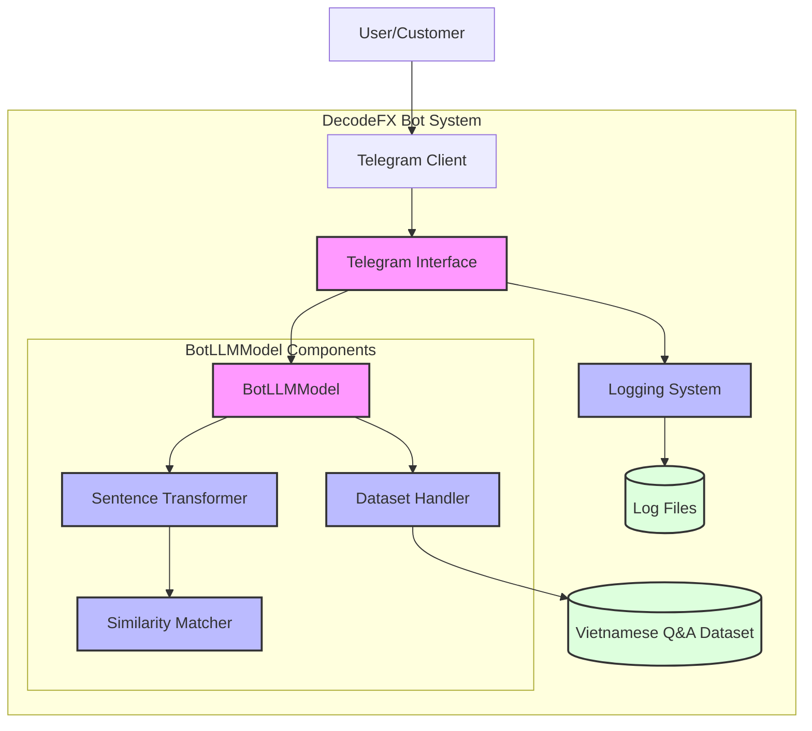
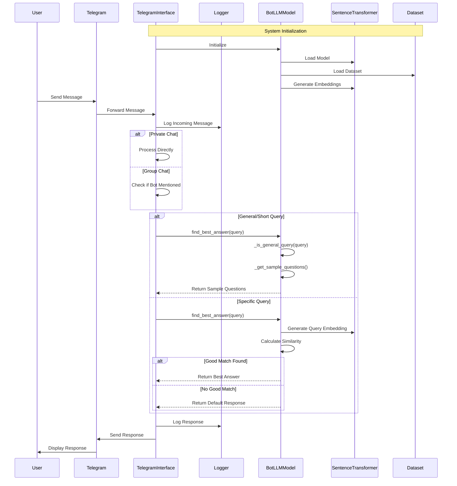

# DecodeFX_Bot

The DecodeFX Support Bot is an advanced customer service chatbot designed specifically for the forex trading platform DecodeFX. Built using state-of-the-art natural language processing techniques, the bot provides instant, accurate responses to customer inquiries in both Vietnamese and English, focusing on trading-related questions, account management, and platform support.
## Key Features
### Multilingual Support

- Seamlessly handles both Vietnamese and English queries
- Processes Vietnamese text with or without diacritics
- Understands informal language and regional variations

### Intelligent Query Processing

- Uses semantic similarity matching for accurate response selection
- Handles misspellings and partial words
- Implements fuzzy matching for better query understanding
- Provides confirmation requests for ambiguous queries

### Context-Aware Conversations

- Maintains conversation context for better response accuracy
- Understands follow-up questions
- Processes conversation history for more relevant responses

### Advanced Natural Language Processing

- Employs the SentenceTransformer model for semantic understanding
- Uses smart confirmation detection for natural dialogue flow
- Implements context mapping for better response accuracy

## 1. Data Processing:

- Processes the markdown dataset into structured QA pairs
- Extracts questions, answers, tags, and priorities
- Maintains context information for better response matching


## 2. Core Bot Engine:

- Uses SentenceTransformer with phobert-base (optimized for Vietnamese)
- Creates embeddings for all questions in the dataset
- Uses cosine similarity to find the best matching response
- Implements confidence threshold for fallback responses
- Try different strategies to get the best response:
    - Try phobert
    - Implements llama_model for for general text generation
    - Try default response

## 3. Telegram Integration:

- Handles incoming messages and commands
- Provides a simple interface for users
- Manages bot lifecycle and error handling

# Local Deployment (For Testing):
```python
# Deactivate current environment
deactivate

# Remove the old virtual environment
rm -rf venv

# Create new virtual environment
python3.11 -m venv venv

# Activate the new environment
source venv/bin/activate

# Upgrade pip
pip install --upgrade pip

# Install requirements
pip install -r requirements.txt

DecodeFX_Bot/
├── .env                    # Environment variables
├── requirements.txt        # Dependencies
├── data/                   # Data directory
│   └── decode-fx-vietnamese-dataset.md
├── logs/                   # Log files directory
├── models/                 # Models directory
│   ├── __init__.py        # Make models a package
│   └── bot_llm.py
├── interfaces/            # Interfaces directory
│   ├── __init__.py       # Make interfaces a package
│   └── telegram_interface.py
├── config.py             # Configuration file
└── main.py              # Main application file
    
```
# Cloud Deployment:

# System Diagram:

# Sequence Diagram:

