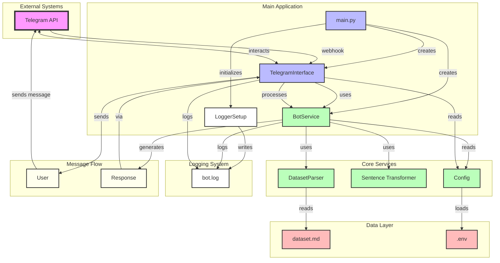
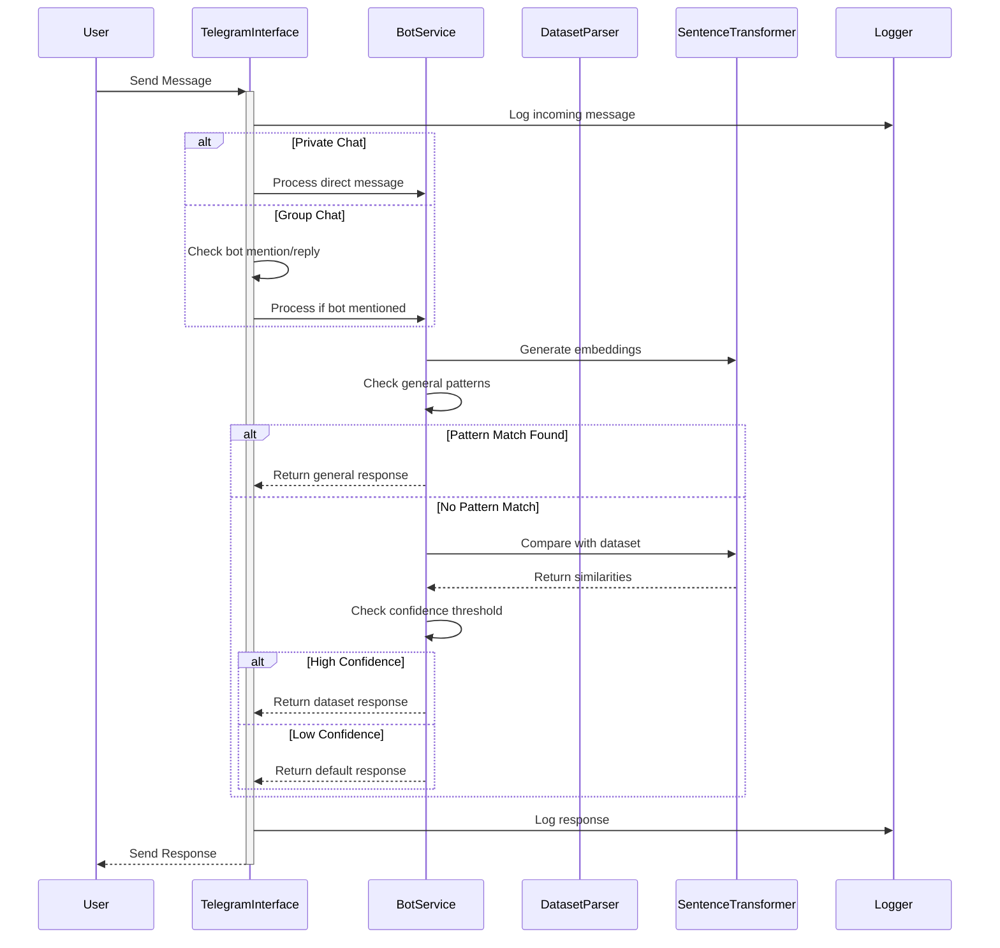

# DecodeFX_Bot
A complete pipeline for DEcodeFX customer service chatbot.

## 1. Data Processing:

- Processes the markdown dataset into structured QA pairs
- Extracts questions, answers, tags, and priorities
- Maintains context information for better response matching


## 2. Core Bot Engine:

- Uses SentenceTransformer with phobert-base (optimized for Vietnamese)
- Creates embeddings for all questions in the dataset
- Uses cosine similarity to find the best matching response
- Implements confidence threshold for fallback responses
- Try different strategies to get the best response:
    - Try phobert
    - Implements llama_model for for general text generation
    - Try default response

## 3. Telegram Integration:

- Handles incoming messages and commands
- Provides a simple interface for users
- Manages bot lifecycle and error handling

# Local Deployment (For Testing):
```python
### 1. Create a directory for your bot
mkdir decodefx-bot
cd decodefx-bot

### 2. Create a virtual environment
Note:
deactivate
rm -rf venv
python3.11 -m venv venv
source venv/bin/activate  # On Windows: venv\Scripts\activate
or use Anaconda

### 3. Install requirements
pip install -r requirements.txt

# 4. Run the bot
python main.py

decode-fx-bot/
├── main.py
├── config.py
├── bot_service.py
├── telegram_interface.py
├── dataset_parser.py
├── logger_config.py
├── requirements.txt
├── .env
├── data/
│   └── dataset.md
└── logs/
    └── .gitkeep
    
```
# Cloud Deployment:

# System Diagram:

# Sequence Diagram:

